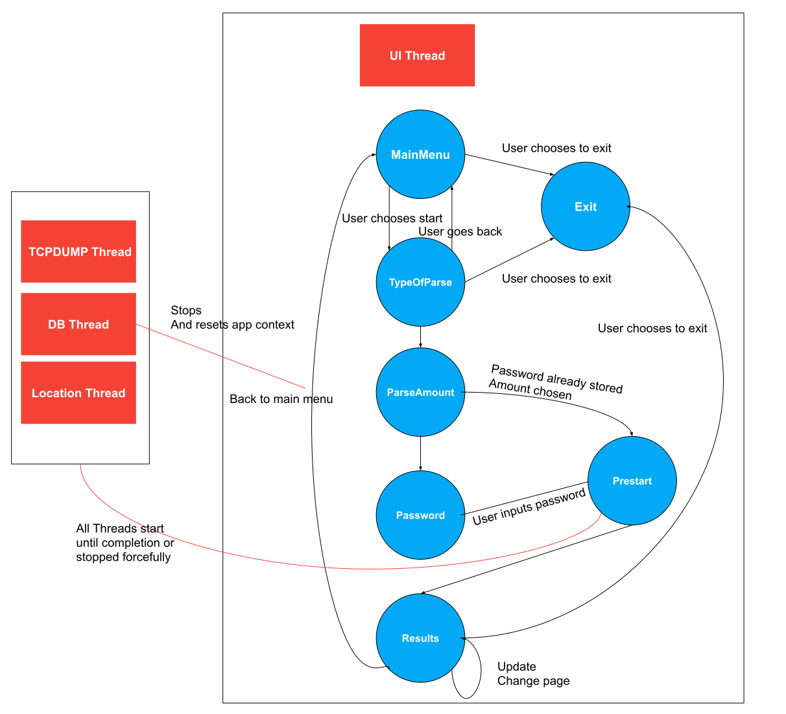

# Dependencies

    $ sudo apt-get install sqlite3
    $ sudo apt-get install libcurl4-openssl-dev
    $ sudo apt-get install libgtest-dev

## Solution Diagram

### Overview

I used visual studio code. After installing the dependencies and the visual studio extensions:
- C/C++ IntelliSense, debugging, and code browsing.
- Catch2, Google Test and DOCtest Explorer

The configuration needed can be found in .vscode folder (for example: compiler flags, etc...)

The solution developed is based on multi threading to allow the fetch and processing of data to happen in background while the user can keep using the application.
The threads are managed by the TaskManager class.
In the context of this project each thread will run a task that is defined in each of the Task classes.
- TaskDB
- TaskTcpDump
- TaskUpdateLocation

The main thread is where the UI is running.

I'm using sqlite because it makes it easier to query the data later and to update location for example.

The other main file that helps managing the flow is MenusManager. This file has instances of the most important classes like menus, thread manager and context.

The context class (MenuContext) is the class that keeps track of the state of the appplication.

Besides these main classes there are some other files that provide some functionality like getting the location from the ip or converting the date, these files are in the utils folder since they are utils that should be able to be used without any context.

### Issues & TODO list

Unfortunately I ended up not having time to implement everything I wanted, so here's a list of improvements/todo things.

1. Add a lot more tests
2. Add more documentation
3. Sometimes when trying to update the results view database might be busy (Just need to update it again)
   - The other option would be to increase the thread priority and make it use the same lock system the other threads use
4. Some files could probably be moved somewhere else and renamed
5. No cross referencing of yet (should be more easily done using some sql queries)
6. Update of tcpdump data might be slow, Ideally we would change so that the data stored on the file would be in pcap format and then we would use tcpdump again in read mode.
7.  Change the way some callbacks work and organize a bit more some of those functions
8.  Improve interface with DB (possibly by using some actual ORM)
9.  Use Qt or something else for UI (which would probably simplify a few things)
10. Add more validations in many places

